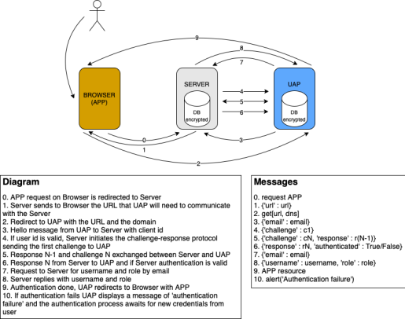

# Correr o projeto

## Server e Database
Utilizando o xampp:
1. Adicionar a pasta `server` do projeto a `/opt/lampp/htdocs`
2. Correr xampp
   1. `cd /opt/lampp`
   2. `sudo ./manager-linux-x64.run`
3. Em `localhost/dashboard`, selecionar phpMyAdmin
4. Importar ficheiro `HPWiki.sql` que se encontra na pasta database
    - emails e passwords:
      - isabella@hotmail.com: iLoveDobby_3
      - john@gmail.com: AvadaKedravaBellatrix
      - lili_martinha@gmail.com: AvadaKedravaBellatrix88

## Client
Na pasta client de cada uma das apps:
1. `npm install`
2. `npm start`

## UAP
`python3 uap.py`

**Requisitos**: `pip install -r requirements.txt`

Utilizadores da UAP:
- jon: secret
- user: userpassword

# Descrição do projeto
Implementação de um protocolo E-CHAP para autenticação de utilizadores na aplicação Harry Potter Wiki.
Inicialmente, o utilizador acede ao site da wiki onde inicia o login clicando no botão. Isto redireciona-o para a UAP, onde pode escolher um dos logins já utilizados por ele ou pode criar um novo. Depois de submeter um login aguarda pelo resposta de autenticação. Se esta for bem sucedida é redirecionado para a wiki. Caso contrário fica na UAP, recebendo uma mensagem de erro.

# Autores

- Isadora Loredo, 91322 
- Patrícia Dias, 98546
- Raquel Ferreira, 98323
- Sophie Pousinho, 97814

## Protocolo
Após a escolha do login por parte do utilizador, é enviada uma mensagem para o servidor com o email do mesmo, de forma a que o servidor possa identificar a existência do utilizador na base de dados. Este por sua vez começa o processo challenge-response, calculando um desafio e a sua resposta. Envia este desafio para a UAP, a qual calcula a sua resposta e envia-a com um novo desafio para o servidor. A partir daqui, sempre que a UAP ou o servidor recebem uma resposta, fazem uma comparação entre a resposta recebida e a sua própria resposta. Se forem diferentes, envia uma resposta aleatória. Se forem iguais continua o processo até completar as N (N=8) vezes. A última mensagem do servidor responde ao último desafio da UAP e se esta foi autenticada ou não. Se a UAP for autenticada, verifica também a autenticidade do servidor. Caso ambos estejam autenticados, a UAP pede o username e o seu role ao servidor. 

## API
A UAP utiliza uma API para aceder às informações dos logins de um utilizador em concreto que estão armazenadas num ficheiro JSON. As credenciais do utilizador da UAP estão encriptadas com a função de hash PBKDF2HMAC. Os logins dos utilizadores são encriptados com a password das credenciais e com um sal, usando o algoritmo DES. Desta forma, podemos usar os dados do login na interface da UAP, ao contrário dos valores encriptados com a função hash. Os valores do sal usados nos 2 casos são guardados também no JSON.

- GET   https://localhost:8443/api -> conjuntos email-password do utilizador
  
- POST  https://localhost:8443/api -> adicionar um conjunto dns-email-password-sal

## HTTPS
Para criarmos um canal cifrado entre o servidor e a UAP, criámos um certificado com a chave correspondente para a UAP e no servidor alterámos as configurações do Apache, seguindo este [link](https://techexpert.tips/apache/enable-https-apache/).

## Cálculo de desafio e resposta
O desafio consiste numa string de 16 bytes aleatórios. Para calcular a resposta começamos por uma função hash PBKDF2HMAC de um hash da password do utilizador (MD5) com a junção de um sal, que é o próprio desafio. A resposta desse desafio é dada pelo cálculo de um XOR pelo primeiro bit de cada byte do resultado da função PBKDF2HMAC.
As passwords na base de dados do servidor já são guardadas com a função MD5.
